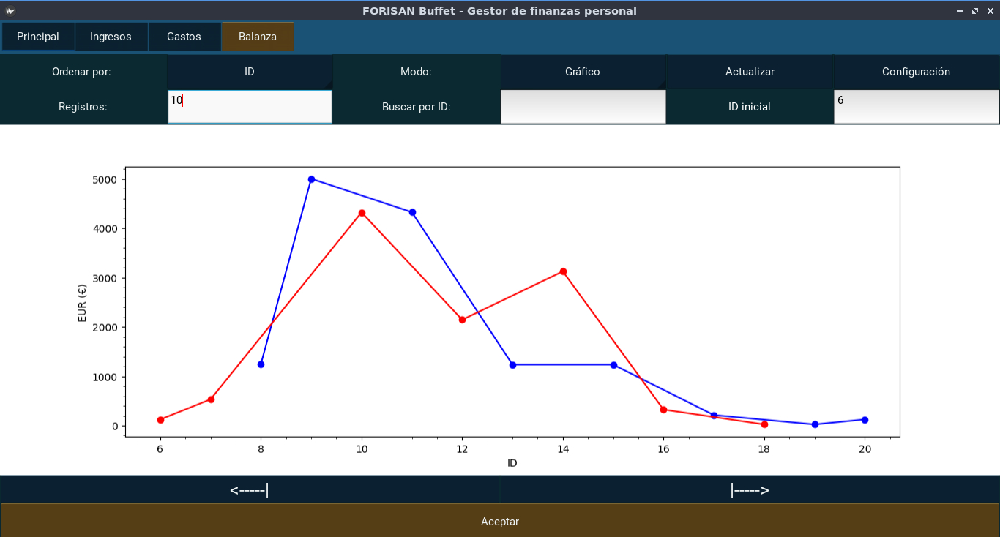
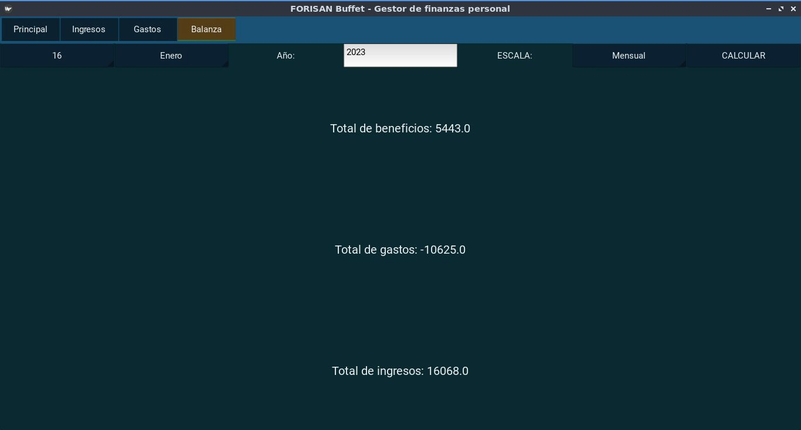
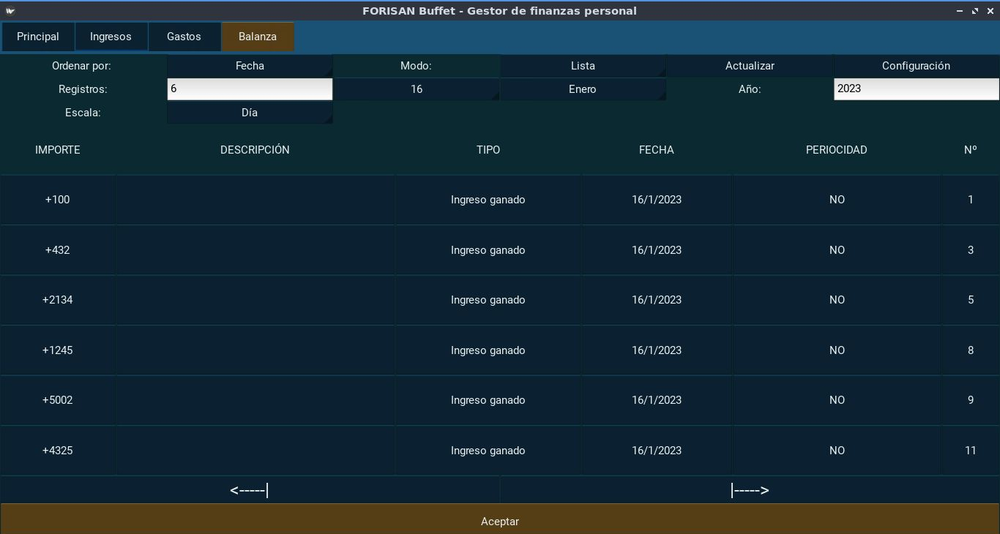
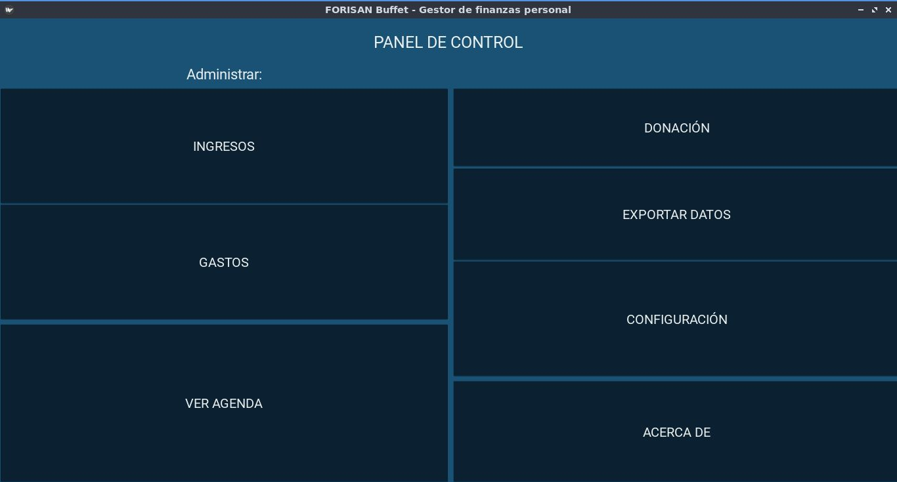
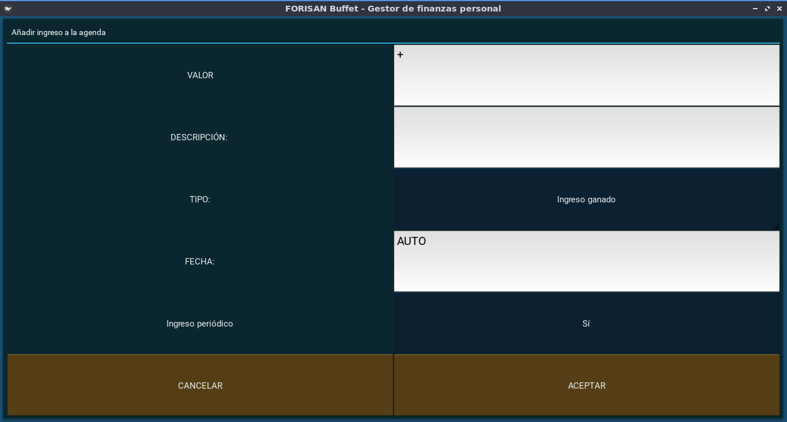
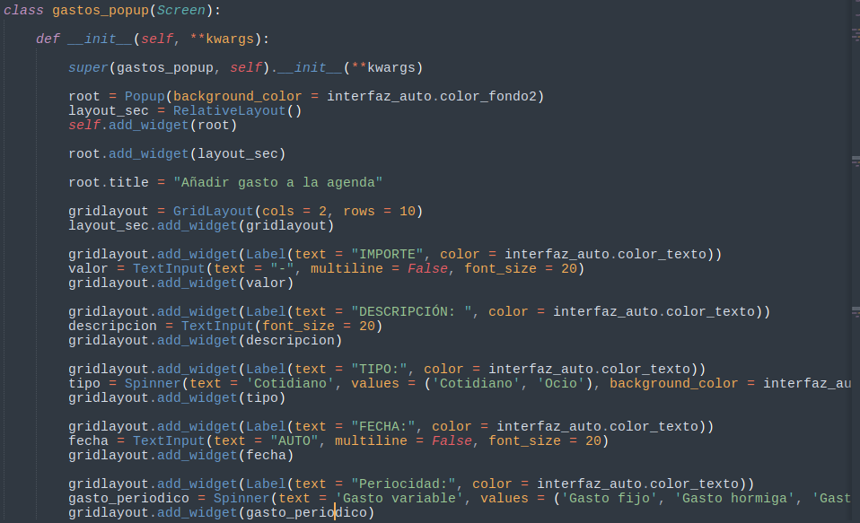
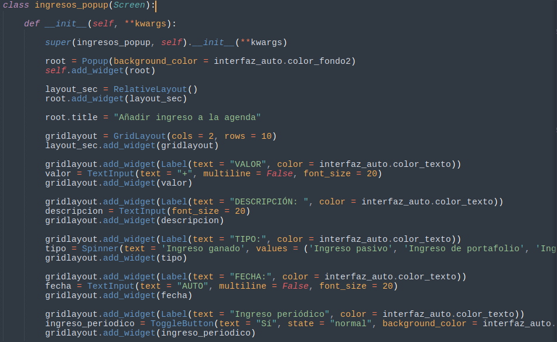
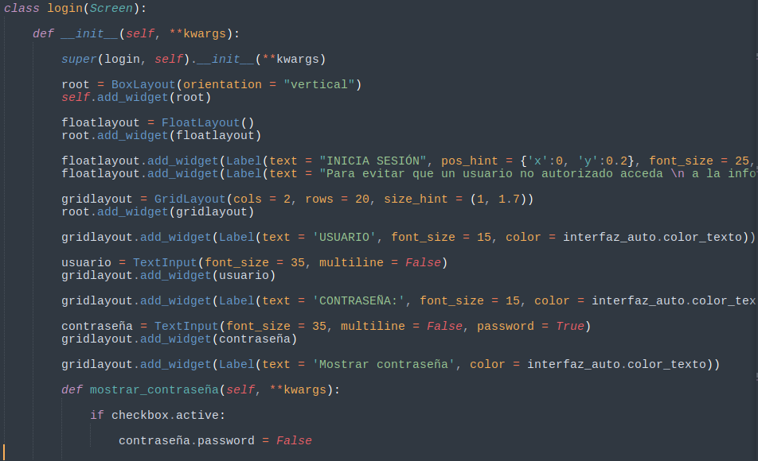
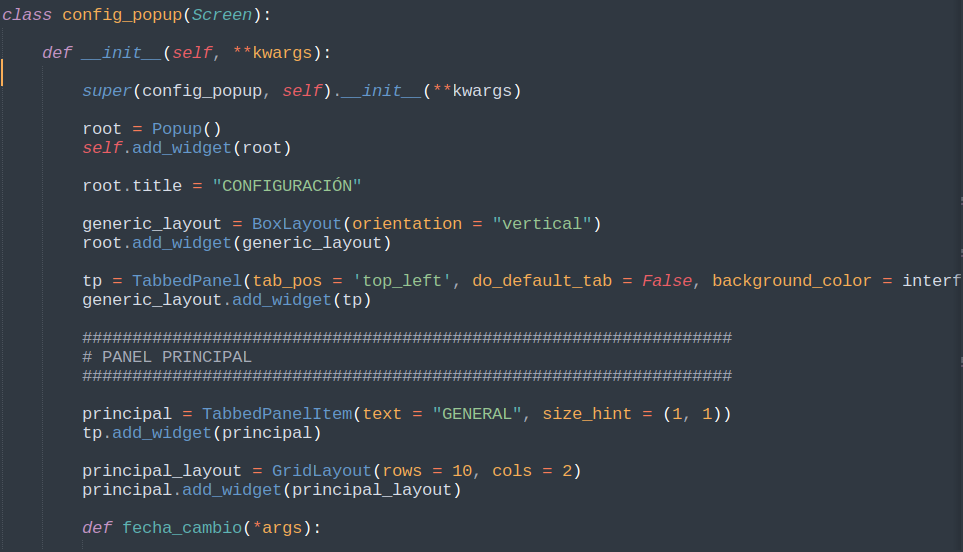

# Buffet Gestor
Buffet Gestor es una agenda de finanzas personales para controlar los ingresos, y gastos.
Su nombre  es en honor al inversionista estadounidense: "Warren Buffet".

Está hecha en python con la tecnología de GUI kivy. Para almacenar los datos se usa SQLite3.
Pues este gestor de bbdd es idóneo para aplicaciones pequeñas que almacenen los datos en el propio dispositivo.

Los datos se pueden representar con gráficos que son elaborados con la libería matplotlib.

Se pueden obtener resumenes financieros seleccionando el periodo de tiempo que deseemos.

## Más vistas:
Registros como filas

**Panel de control**

**Añadir un registro de ingreso a la agenda**

## Vídeo de demostración:
[Ver video](vid/1.mp4)

## Muestras de código
**Añadir gasto**

**Añadir ingreso**

**Iniciar sesión**
No es realmente inicio de sesión en una web, sino una forma de proteger la agenda
Las credenciales se configuran la primera vez que se ejecuta la app (cuando no hay nada guardado en BBDD)

**Configuración**

